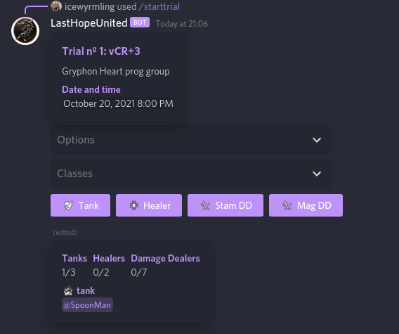
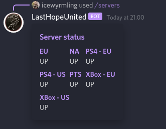
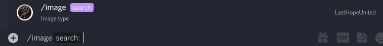
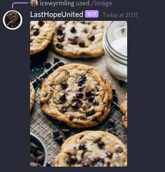
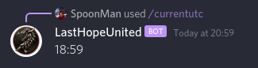
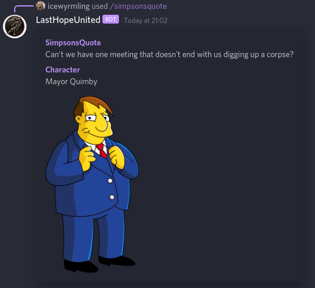
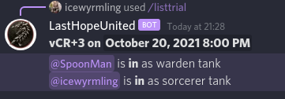
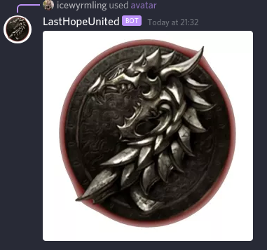

# LastHopeUnited BOT

> Discord bot for raid organisation for The Elder Scrolls Online  
> Made using DiscordJS

</br>

## **SLASH COMMANDS**

``` /starttrial ```

Makes a sign-up form for the trial
> <i>trial</i>: add trial name  
> <i>tanks</i>: set number of tanks  
> <i>date</i>: set date (format: dd/mm/yyyy)  
> <i>time</i>: set time (format: hh:mm UTC)  
> <i>multirole</i>: enables the sign up with more than one role  
> <i>description(optional)</i>: add event description  

<br>

<p>Options: set main role; delete role; set main dd portal; delete portal; delete sign-up </p>

 

``` /servers ```

<p>Display ESO server status for all servers</p>



``` /image```
<p>Display random image </p>




``` /currentutc```

<p>Display current time in UTC</p>



``` /simpsonsquote```

<p>Display a random Simpsons quote</p>



``` /listtrial```
> <i>trialID</i>: trial number 
<p>Post the roster for trial</p>



</br>

## **CONTEXT MENU COMMAND**

``` /avatar```
<p>Shows avatar of selected user</p>

